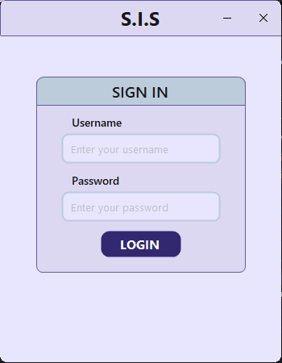
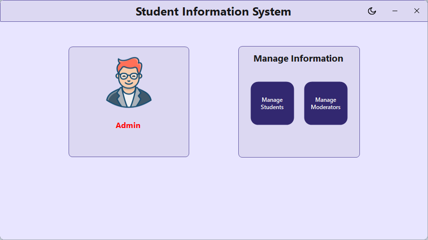

# Student Information System

## Table of Contents
1. [Project Overview](#project-overview)
2. [Features](#features)
3. [Screenshots](#screenshots)
4. [Installation Guide](#installation-guide)
5. [Credits](#credits)
6. [License](#license)
---

## Project Overview
The **Student Information System** (SIS) is designed to help manage student data using a serverless SQLite database structure, enabling use without the need for a dedicated server. The application allows for managing information through the primary operations of **Create**, **Read**, **Update**, and **Delete** (CRUD). 

### Roles:
- **Admin**: Can manage both students and moderators.
- **Moderator**: Can manage students only.
- **Student**: Can view their own information.

The application uses `System.Security.Principal` for user authentication to manage sessions and enforce role-based access control.

---
## Features
- **Role-Based Access Control**: Different permissions for Admins, Moderators, and Students.
- **Simple and Intuitive UI**: User-friendly interface for managing student data.
- **CRUD Operations**: Easy creation, reading, updating, and deletion of records.
- **Secure Authentication**: Uses `System.Security.Principal` for session management and secure user access.
- **Theme Support**: Light and dark mode to suit user preferences.
- **Profile Management**: Allows users to update and manage profile information.
---
## Screenshots



---
## Installation Guide
1. **Clone the repository**:  
   ```bash
   git clone https://github.com/Ragnard-Kiseki/Student-Information-System.git
   ```
2. **Navigate to the directory**:
   ```bash
   cd Student-Information-System
   ```
3. **Install dependencies**:  
   ```bash
   dotnet restore
   ```
4. **Run the application**:
   ```bash
   dotnet run
   ```
---
## System Requirements:
- Windows OS (Tested)
---

## Credits
- Developed by Ko0  
- GitHub: [Ragnard-Kiseki](https://github.com/Ragnard-Kiseki)  
- Discord: .ko0

## License
This project is licensed under the MIT License - see the [LICENSE](./LICENSE) file for details.